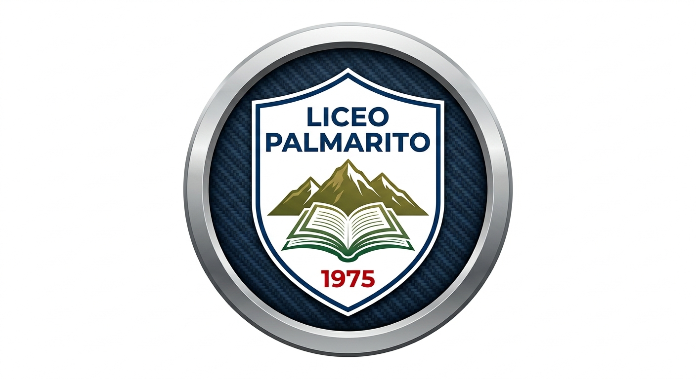

<p align="center">
  
</p>

# Portal Educativo – Liceo Palmarito

Plataforma educativa hecha para la U.E. Liceo Palmarito y la Profesora **Anuvis Medina**.

Este portal está diseñado para facilitar el acceso de estudiantes, maestros y representes a contenidos educativos digitalizados, evaluaciones y comunicación eficiente con la maestra.

---

## 🚀 Características principales

- **Instalable como App (PWA):** Se puede agregar a pantalla de inicio en cualquier dispositivo.
- **Acceso para alumnos y docentes:** La plataforma permite la gestión segura de usuarios.
- **Administración amigable:** La maestra puede gestionar su sección, agregar alumnos y recursos educativos.
- **Funciona offline:** Trabaja incluso sin conexión si has entrado al menos una vez.
- **Seguridad:** Integración con autenticación en Supabase.

---

## 🖼️ Demo

Acceso online: [Portal Liceo Palmarito](https://liceo-palmarito-portal-3.onrender.com)

---

## 🛠️ Tecnologías usadas

- **React + Vite**
- **TypeScript**
- **Supabase (Auth y DB)**
- **Render.com** (deploy automático)
- **PWA (service worker, manifest, icons)**

---

## 📦 Instalación y desarrollo local

```bash
git clone https://github.com/hunter32378/liceo-palmarito-portal.git
cd liceo-palmarito-portal
npm install
npm run dev

📱 Instalación como App
Abre el portal en tu navegador móvil o PC, busca el ícono “Instalar App” o usa el menú de opciones de tu navegador para “Agregar a pantalla de inicio”